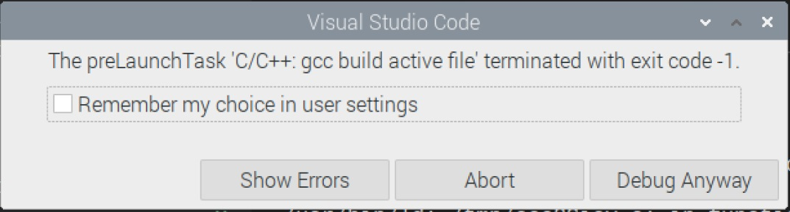

## EGR 111 - Introduction to Computer Science (C Programming)

### [EGR111](../../) - [Sprint 3](../) - Week 09 

**Session 1**
- Midterm grading completed
  - pull grading form
    - [Example Grading Form](egr_example_grading.pdf){:target='_blank'}
  - credit for late work
  - Review - any issues must be resolved this week

- Midterm Review
  - [MC Report](midterm_mc_report.pdf){:target='_blank'}
  - Coding 
    - solution
    - use of AI?
    
- tic tac toe project
  - status?
  - solutions?
  - stubs and mocks


- Multiple file solutions
  - Include files
  - Make files
  - Function declaration/definition review

```C
//functions_01.c
#include <stdio.h>

void function1();
void function2();

void main()
{
    function1();
    function2();
}

void function1()
{
    printf("Function 1\n");
    function2();
}

void function2()
{
    printf("Function 2\n");
}
```

- Move function declaration to a header file

```C
//functions.h
#include <stdio.h>

void function1();
void function2();
```

- Reference functions using a the header file. Note <stdio.h> is no longer in main.

```C
// #include <stdio.h>
#include "functions.h"

void main()
{
    function1();
    function2();
}

void function1()
{
    printf("Function 1\n");
    function2();
}

void function2()
{
    printf("Function 2\n");
}
```

- Run/debug function_02 test

- Multiple files
- Create main.c that calls functions

```C
#include "functions.h"
//make required
int main()
{
    function1();
    return 0;
}
```

- revised functions

```C
#include "functions.h"

void function1()
{
    printf("Function 1\n");
    function2();
}

void function2()
{
    printf("Function 2\n");
}
```

- build error


- makefile is required when using multiple source files.

```Console
# gcc compiler
# -g flag to generage debugger info
# -o output file name
Build:
  gcc -g -o my_program main.c functions.c
```


- EGR111 workspace setup for multiple files
  - Use the following to copy the makefile to the EGR111 workspace folder
    - wget https://k2controls.github.io/EGR111/resources/makefile
  - rename tasks.json in .vscode directory to tasks.json.bak
  - Use the following to update the VS Code configuration in the .vscode directory
    - wget https://k2controls.github.io/EGR111/resources/launch.json
    - wget https://k2controls.github.io/EGR111/resources/tasks.json

- Update makefile src_dir to point to current directory
- Open terminal and enter make command. Note binary main in bin directory.
- Set breakpoint in main(). Run debugger and verify breakpoint and debug. 

--- 


### Assignments
- tictactoe.c
solution
- week09 has the following directories and related files.
    - multi_files (3 files)
    - swap (3 files)
    - ttt (1 files)
- makefile
- bin directory
