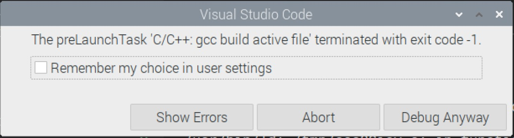

## EGR 111 - Introduction to Computer Science (C Programming)

### [EGR111](../../) - [Sprint 3](../) - Week 09 

**Session 1**
- Midterm grading completed
  - pull grading form
    - [Example Grading Form](egr_example_grading.pdf){:target='_blank'}
  - credit for late work
  - Review - any issues must be resolved this week

- Midterm Review
  - [MC Report](midterm_mc_report.pdf){:target='_blank'}
  - Coding 
    - solution
    - use of AI?

**Session 2**    

- *Session 1 Review* - tic tac toe project
  - Top down - main() represents game play
  - Next step: stubs and mocks
  - [ttt with stubbing](ttt_with_stubbing.md){:target='_blank'}

- Multiple file solutions
  - Updated configuration
    - Solutions must be located in their own subdirectory
    - Example: week09/multi_files
      - [functions.h](multi-files/functions_header.md)
      - [main.c](multi-files/main.md)
      - [functions.c](multi-files/functions.md)
  
  - Attempting existing build and debug task (F5)?
    - build error
      >
  
  - gcc build required at terminal prompt to compile and link multiple files. While this works, creating a makefile will assist.

```Console
# gcc compiler
# -g flag to generage debugger info
# -o output file name
Build:
  gcc -g -o my_program main.c functions.c
```

### Configuration Steps for multiple file solutions

1. makefile is required when using multiple source files.

***Use the following to copy the makefile to the EGR111 workspace folder***

```console
wget https://k2controls.github.io/EGR111/resources/makefile
```

2. VS Code configuration update is required.
  - view .vscode directory located at the top of workspace
  - rename existing *tasks.json* to *tasks.json.bak*
  - Use the following to add new VS Code configuration files to the .vscode directory

```console
wget https://k2controls.github.io/EGR111/resources/launch.json

wget https://k2controls.github.io/EGR111/resources/tasks.json
```

3. Add a *bin* directory to your workspace. This will be location for the binary file created by any make/build.
  - The top of your workspace should match the image below.
    - 

4. Open the makefile and verify the src_dir variable is pointing at the week09/multi_files directory

5. Press F5 to complete build and launch debug.

### Example 2: Swap

- Add the following to a new *swap* solution folder in this week directory.

```console
wget https://k2controls.github.io/EGR111/sprint3/week09/swap/swap.h

wget https://k2controls.github.io/EGR111/sprint3/week09/swap/swap.c

wget https://k2controls.github.io/EGR111/sprint3/week09/swap/main.c

```

- Update makefile src_dir to point to this new solution 
  - *src_dir = sprint3/week09/swap*
- Set breakpoint in main(). Run debugger (F5) and verify breakpoint and debug. 

### Continue with ttt

- Copy your week08 to a ttt solution folder in week09.
- If your week08 solution was function, adjust the makefile src_dir and test.
- if you did not have a functional ttt solution, complete the solution using the revised debug process (makefile).

--- 


### Assignments
- tictactoe.c solution in ttt, Be sure to use new makefile to run and test.
- week09 has the following directories and related files.
    - multi_files (3 files)
    - swap (3 files)
    - ttt (1 files)
- makefile
- bin directory
