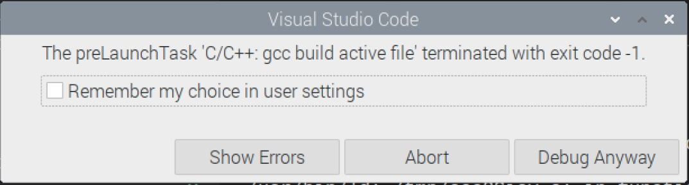

## EGR 111 - Introduction to Computer Science (C Programming)

### [EGR111](../../) - [Sprint 3](../) - Week 08 

**Session 1**

- Midterm Review
  - MC Report
  - Coding 
    - grading in progress
    - solution
    - use of AI? Class policy moving forward
- tic tac toe project
  - solution
  - top down design only. No game implementation to start.
  - team solution - include team members in header
    - teams
      - Team 1:
      - Team 2:
      - Team 3:
    - pair coding using repl
    - copy share URL to chat or send a message to me via Zoom.
  - Report-out on main solution.
  - Implement solution.

**Session 2**

- ttt.c review

- Multiple file solutions
  - Include files
  - Make files
  - Function declaration/definition review

```C
//functions_01.c
#include <stdio.h>

void function1();
void function2();

void main()
{
    function1();
    function2();
}

void function1()
{
    printf("Function 1\n");
    function2();
}

void function2()
{
    printf("Function 2\n");
}
```

- Move function declaration to a header file

```C
//functions.h
#include <stdio.h>

void function1();
void function2();
```

- Reference functions using a the header file. Note <stdio.h> is no longer in main.

```C
// #include <stdio.h>
#include "functions.h"

void main()
{
    function1();
    function2();
}

void function1()
{
    printf("Function 1\n");
    function2();
}

void function2()
{
    printf("Function 2\n");
}
```

- Run/debug function_02 test

- Multiple files
- Create main.c that calls functions

```C
#include "functions.h"
//make required
int main()
{
    function1();
    return 0;
}
```

- revised functions

```C
#include "functions.h"

void function1()
{
    printf("Function 1\n");
    function2();
}

void function2()
{
    printf("Function 2\n");
}
```

- build error


- makefile is required when using multiple source files.

```
# gcc compiler
# -g flag to generage debugger info
# -o output file name
Build:
  gcc -g -o my_program main.c functions_03.c
```


- EGR111 workspace setup for multiple files
  - Use the following to copy the makefile to the EGR111 workspace folder
    - wget https://k2controls.github.io/EGR111/resources/makefile
  - rename tasks.json in .vscode directory to tasks.json.back
  - Use the following to update the VS Code configuration in the .vscode directory
    - wget https://k2controls.github.io/EGR111/resources/launch.json
    - wget https://k2controls.github.io/EGR111/resources/tasks.json

- Update makefile src_dir to point to current directory
- Open terminal and enter make command. Note binary main in bin directory.
- Set breakpoint in main(). Run debugger and verify breakpoint and debug. 

--- 


### Assignments
- tictactoe.c
solution
- week09 has the following directories and related files.
    - multi_files (3 files)
    - swap (3 files)
    - ttt (1 files)
- makefile
- bin directory
