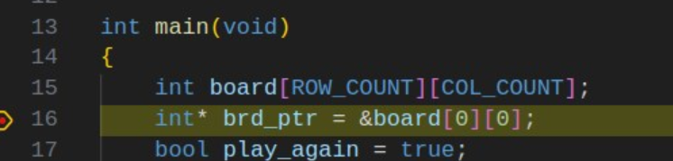
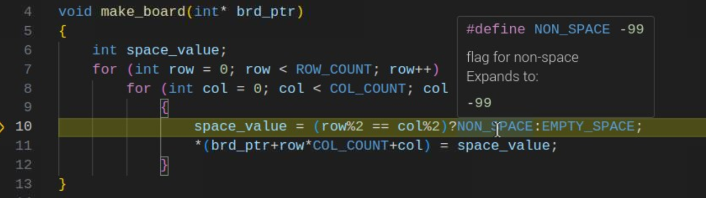
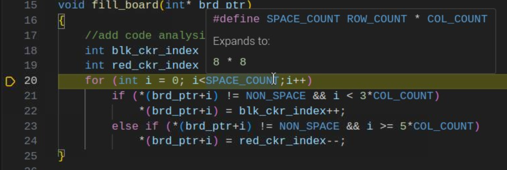
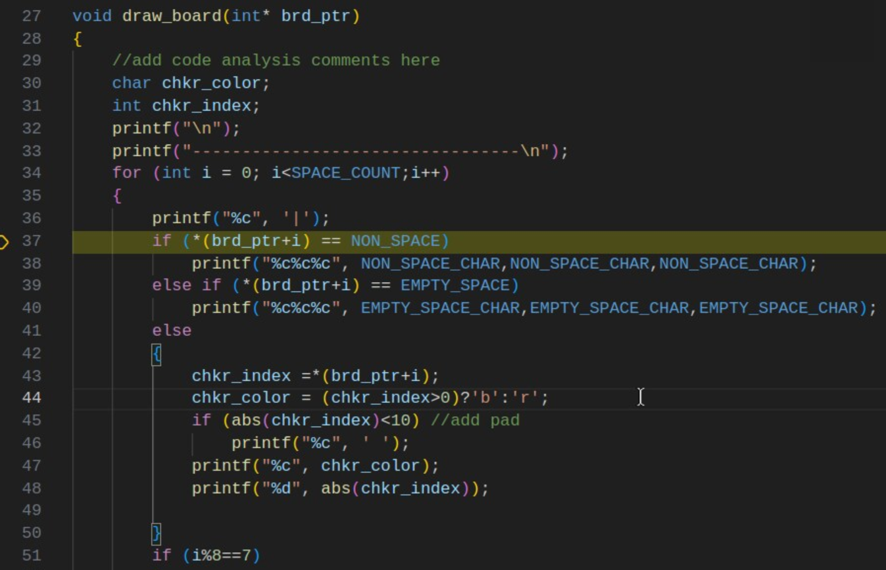

## EGR 111 - Introduction to Computer Science (C Programming)

### [EGR111](../../) - [Sprint 4](../) - Week 10

**Session 1**

- Review of Week 09
  - Modified tasks.json and launch.json
  - use of makefile
    - issue/error if no bin directory or bin empty or bin in use
    - makefile - revised with new clean: functionality

```console
wget https://k2controls.github.io/EGR111/resources/makefile
```

- **Tic Tac Toe** - solution review
  - instructor will review implementation of functions specified during last week's session.
  - Q/A - how did you implement? Issues?

- **Tic Tac Toe with Board Pointer** 
  - In general, global variables should not be used.
    - Your goal should be to control access and modification
    - Ideally, all code is tested using Unit Tests. Tests cannot be constructed for functions that rely on global values.
  - **ttt_with_brd_ptr**
    - Instructor demo
    - Mult-file solution
    - Refactored prior Tic Tac Toe solution to use board pointers

- Week 10 project - Checkers
  - Requirement: Create a first version of checkers enabling Black and Red players to move their checkers to open spaces. **No Jump move required!**
  - Process:
    1. Download starter files
    2. Work with your partner to analyze starter solution. Add comments. Be prepared to share.
    3. Work on your own to implement code required for method stubs.

  - Install - create a chkrs directory in a week10 directory.
  - Copy the following starter code

```
wget https://k2controls.github.io/EGR111/sprint4/week10/chkrs/main.c
wget https://k2controls.github.io/EGR111/sprint4/week10/chkrs/checkers.h
wget https://k2controls.github.io/EGR111/sprint4/week10/chkrs/checkers.c

```

- Here's a video showing game play for this early version. Note that jumping is not implemented.
  <video src="chk_starter_video.mp4" controls title="Checkers Game Play"></video>

- Here's a [graphic](chkr_brd.pdf){:target='_blank'} showing checker starting positions and cell indexes. Note red position does not match existing code.
- Edit your make file and run the code. The B12 checker is moved. 
- Single step the code and not the methods provide as well as stub code used to move checker B12.
- Step 1 - The instructor will break you into teams. Complete the code review with your team member adding significant comments describing the code function.
- Step 2 - Implement a version 1 of the game that enables each player to select a checker and move it to an open space. See video for an example.
        
**Session 2**

#### chkrs - version 1: move to open spaces
- Review of starter project with stubs
  - Local board variable with pointer
  - [chkr_brd.pdf](chkr_brd.pdf){:target='_blank'}
  - 

  - What is line 10 doing in the make_board function?
  - *Required:* Add comment describing make_board function.
  - 

  - How is fill_board adding red and black checkers to the board?
  - How are black checkers distinguished from red checkers?
  - Describe the purpose/function of the conditional on line 21.
  - *Required:* Add comment describing fill_board function.
  - 

  - How is draw_board rendering the board?
  - How are non-playing spaces displayed?
  - How are red vs black checkers rendered on the board?
  - Why are lines 45 and 46 added?
  - *Required:* Add comment describing draw_board function.
  - 

  - *get_checker_number()* - a stub
    - Complete required coding with your partner
    - Be sure to validate the user's input. Checker numbers are 1 through 12.
    - Why is the player parameter included?
    - What if the player enters a valid checker number but that checker is no longer on the board?
    - *Required:* Functional code with comment describing your function solution. 

  - *get_checker_position()* - a stub
    - Complete required coding with your partner
    - What value is this function returning?
    - What value should be returned if the checker_number provided is no longer on the board?
    - *Required:* Functional code with comment describing your function solution. 
          
  - *has_moves()* - a stub
    - Complete required coding with your partner
    - There are four possible moves
      - MOVE_DOWN_LEFT
      - MOVE_DOWN_RIGHT
      - MOVE_UP_LEFT
      - MOVE_UP_RIGHT
    - if a black checker is selected which moves are valid? (no Kings for now!)
    - if a red checker is selected which moves are valid? (no Kings for now!)
    - Review the [chkr_brd.pdf](chkr_brd.pdf){:target='_blank'} again.
      - If the selected checker is black how can you determine the target position given move direction. Is there a specific offset from the selected position?
      - What are offset values if the checker is red?
      - Finally, what if the user is asking you to move the checker off of the edge of the board. Is that a valid move?
    - Remember that this function is just checking for possible moves. It returns true if there is one or move valid moves and false if there are no moves possible for the selected checker.  
    - *Required:* Functional code with comment describing your function solution. 

  - *get_move_direction()* - a stub
    - Complete required coding with your partner
    - Recall that the user is entering values on the keypad with the following numeric values indicating directions.
      - *7=upleft,9=upright,1=downleft, 3=downright*
    - Note that a current player parameter is not provided here, so any of the four values are valid.  
    - *Required:* Functional code with comment describing your function solution. 

  - *get_next_position()* - a stub
    - Complete required coding with your partner
    - Review the offset values determined in has_moves().
    - Given the current_position, a move_direction, and your understanding of move offsets. Calculate the index of the next position and return.  
    - *Required:* Functional code with comment describing your function solution. 

  - *is_valid_position()* - a stub
    - Complete required coding with your partner
    - Given the next_position for the checker, what determins if this next space is available for a move? Return true is the nex move is good! (Again, no jumping for now.)
    - *Required:* Functional code with comment describing your function solution. 

  - *move_checker()* - this function is complete
    - But...
    - *Required:* Add a comment describing your function solution. 

- Can you complete the additional 'stubbed' code to complete the solution. Again, this version is just allowing red and black checkers to move to open spaces.

---

### Assignments
- Checkers - version 1 - basic checker moves

