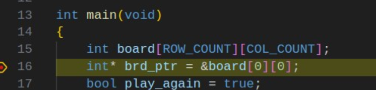

## EGR 111 - Introduction to Computer Science (C Programming)

### [EGR111](../../) - [Sprint 4](../) - Week 11

**Session 1**

- chkrs - version 1: move to open spaces
  - Review of starter project with stubs
    - Local board variable with pointer
    - [chkr_brd.pdf](../week10/chkr_brd.pdf){:target='_blank'}
    - 
  
  - status/report out  
  - function review: What issues did/do you have? How are these resolved?

- Unit testing
  - [Why Testable Code Matters](https://www.toptal.com/qa/how-to-write-testable-code-and-why-it-matters){:target='_blank'}
  - A very simple testing framework
    - [acutest](https://github.com/mity/acutest){:target='_blank'}

```Console
wget https://k2controls.github.io/EGR111/resources/acutest.h
```  
  
  - A First Look: earlier *multi_files* solution
    - copy week09's multi_files to week11
    - Use *wget* above to add acutest.h to *multi_files* folder
    - Modify the functions.h header file to the following
    - *Always include the TESTING definition in the header.* This allows you to easily switch between test mode and the normal run of main().
  
```C
#include <stdio.h>
#include <stdbool.h>

#define TESTING false   //This is in every header file moving forward

void function1();
void function2();
int add_two_nums(int a, int b);
```

3. Add the following definition to functions.c

```C
int add_two_nums(int a, int b)
{
    // int z = a + b;
    int z = a + b + 1;   //make this fail
    return z;
}
```

4. add test_functions.c

```C
#include "functions.h"

#if TESTING
#include "acutest.h"

void test_add_two(void)
{
    //arrange
    int m = 2;
    int n = 3;
    int p = 0;
    //act
    p = add_two_nums(m, n);
    //assert
    TEST_CHECK(p == 5);
}

// List of tests - key, value pairs with {NULL, NULL} termination.
TEST_LIST = {
    { "can_add_two", test_add_two },
    { NULL, NULL }
};

#endif
```

5. Modify main.c as shown below. You are making the main compilation conditional on the TESTING flag. This prevent multipl main() functions from being defined.
   
```C
#include "functions.h"

#if !TESTING    //not TESTING

int main()
{
    function1();
    function2();
    int z = add_two_nums(1,3);
    printf("%d\n", z);

    return 0;
}

#endif 
``` 

- Update your makefile to run this new multi_files solution
- Run solution with TESTING flag set to true
  - modify add function to pass
- Run solution with TESTING flag set to false

**More Unit Testing - a tic tac toe example**
- create a ttt_testing directory in week11
- copy acutest.h to this new directory
- add the following solution and test files.

```
wget https://k2controls.github.io/EGR111/sprint4/week11/ttt_testing/main.c
wget https://k2controls.github.io/EGR111/sprint4/week11/ttt_testing/test_ttt.c
wget https://k2controls.github.io/EGR111/sprint4/week11/ttt_testing/tictactoe.c
wget https://k2controls.github.io/EGR111/sprint4/week11/ttt_testing/tictactoe.h

``` 


**Session 2**
- Week 10 chkrs status (version 1: checker move only)
    - functional? Issues?

- Unit test using acutest.h 
  - Review of Session 1 multi-files

- More Unit Testing - a tic tac toe example
  - create a ttt_testing directory in week11
  - copy acutest.h to this new directory
  - add the following solution and test files.

```
wget https://k2controls.github.io/EGR111/sprint4/week11/ttt_testing/main.c
wget https://k2controls.github.io/EGR111/sprint4/week11/ttt_testing/test_ttt.c
wget https://k2controls.github.io/EGR111/sprint4/week11/ttt_testing/tictactoe.c
wget https://k2controls.github.io/EGR111/sprint4/week11/ttt_testing/tictactoe.h

``` 

Session 2

<!-- **Checkers with Jump(version 2)**
- review main and plan
  - must jump
  - no kings
  - allows backward motion
  - no multi-jumps

- testing
  - run tests
  - [strings in C](https://www.geeksforgeeks.org/strings-in-c/){:target='_blank'}
  - Strings - operations and functions
    - [strcpy](https://www.geeksforgeeks.org/strcpy-in-c/){:target='_blank'}
    - [strcat](https://www.geeksforgeeks.org/strcat-in-c/){:target='_blank'}
    - [strcmp](https://www.geeksforgeeks.org/strcmp-in-c/){:target='_blank'}
  - Unit Tests
    - void can_make_checker_string(void)
    - void can_make_king_checker_string(void)
- Complete tests on your own  -->

---

### Assignments
- Checkers - version 1 (in week10) - basic checker moves
- Multiple Files with acutest testing - functional
- Checkers - version 2 
  - install and tested
  - in progress  

