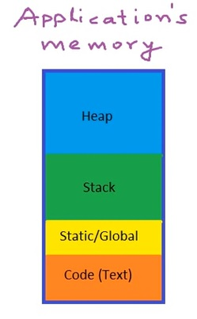
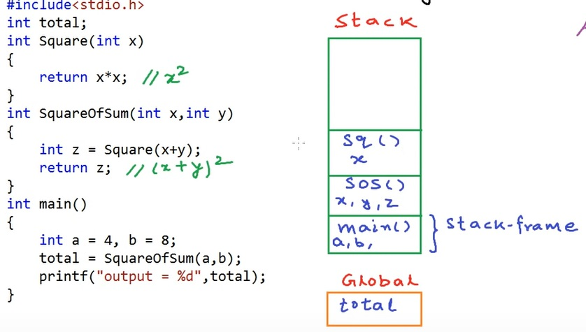
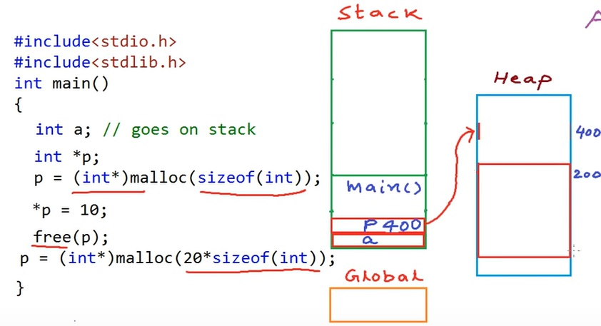
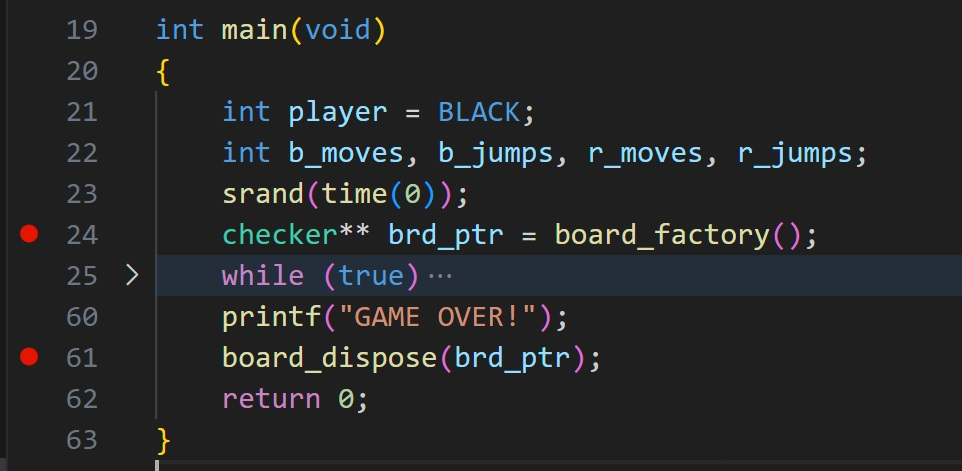
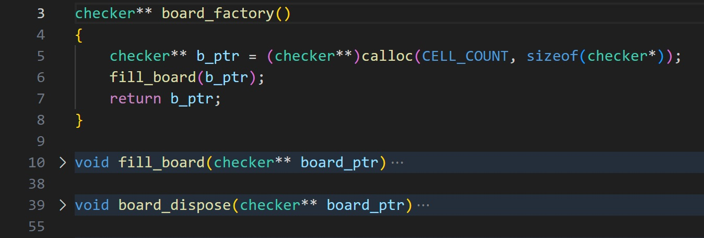

## EGR 111 - Introduction to Computer Science (C Programming)

### [EGR111](../../) - [Sprint 4](../) - Week 12

**Schedule**
- Week 12
  - Session 1 - chkrs2
    - build chkrs_v2 (no main.c for now)
    - Review bitwise and discuss v2 checker flags
    - Review requirements/tasks
  - Session 2 - dynamic memory 
- Week 13
  - Session 1 
    - chkrs_v2 status and review
    - structs and unions
  - Session 2 - chkrs 3 with dynamic structs - demo only
- Week 14
  - Session 1 
    - chkrs_v2 status and review
    - Linked Lists
  - Session 2 
    - OOPS
    - Team report-out demo on Chkrs_v2
    - final project introduction
- Week 15
  - Session 1 - No class, final project working session
  - Session 2 - No class, final project due at end of the day    
  
**Session 1**
  
- Chkrs_v2 - install on to Pi
  - keep week11 chkrs_v2 for now.
  - create week12
  - create week12/chkrs_v2
  - copy acutest.h to target
  - install the following. There is no main.c at this time.

```
wget https://k2controls.github.io/EGR111/sprint4/week12/chkrs_v2/checkers.h
wget https://k2controls.github.io/EGR111/sprint4/week12/chkrs_v2/checkers.c
wget https://k2controls.github.io/EGR111/sprint4/week12/chkrsv2/test_checkers.c

```

- Revise make file sourceand run code (tests).
  - Fails
    - jump not implemented - #TODO
    - comment out line 452 for now
    - 3 of 24 unit tests fail
- Review bitwise operations
  - [BitwiseDiscussion.xlsx](BitwiseDiscussion.xlsx)
  - Review checker flags - BLACK,RED, KING, NO_PLAY_CELL
  - example: checker_id for last red (checker number 12) as a king is 0x6C or 0110 1100
  - Review fill black, fill red, is red, is black functions
- chkrs_v2 requirements
  - Review team requirements in Kanban board (Trello)
  - Discuss and enter "Acceptance Criteria"
  - Assign tasks to team members
  - Team scrum/stand-up/status report next Monday


**Session 2**

[checker board image](chkr_brd.pdf){:target='_blank'}

- chkrs_v2 - in progress
  - Requirements - see Kanban (on Trello)
  - Monday scrum
    - What have I done?
    - What do I need to do?
    - What impedements or blockers
  - Be sure you're pushing code by Monday

- Memory concepts - data on the stack
  - [bad demo code](chkrs_on_stack/main.c)   
  - [image of stack](chkrs_on_stack/checkers_on_stack.pdf) {:target='_blank'}   
- Memory concepts - allocating heap
  - [Pointers and dynamic memory - stack vs heap](https://www.youtube.com/watch?v=_8-ht2AKyH4&ab_channel=mycodeschool){:target='_blank'}
    - four sections
      - program/code
      - Static/global
      - Stack
      - Heap 
  - Memory organization
    - 
  - Function calls with stack
    - 
  - Dynamic memory allocation - heap
    - 
  - 
  - 

- [dynamic-memory-allocation](https://www.geeksforgeeks.org/dynamic-memory-allocation-in-c-using-malloc-calloc-free-and-realloc/){:target='_blank'}

### Assignments
- chkrs_v2 - in progress, progress reported in next week's stand up. 
