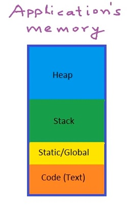
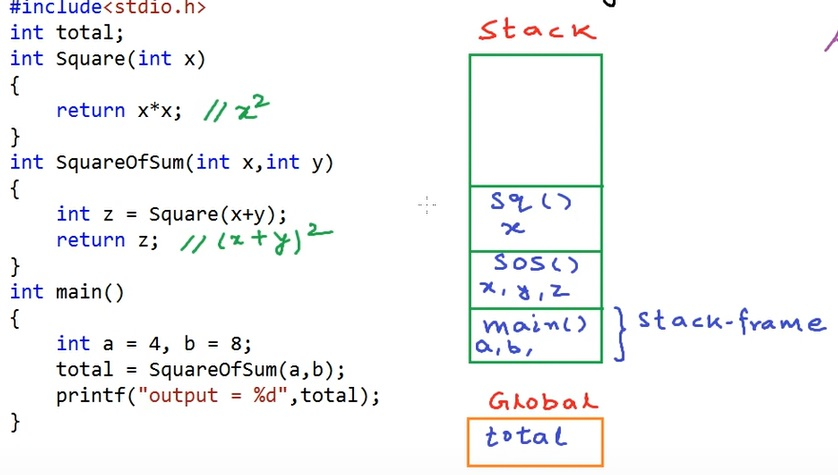
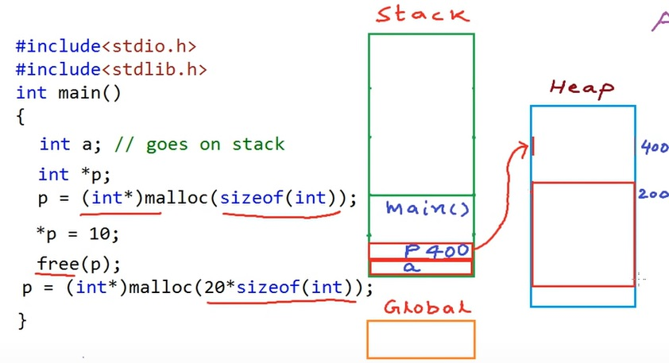
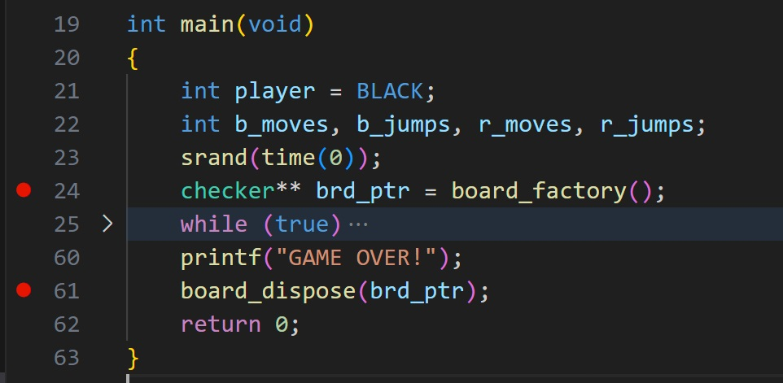
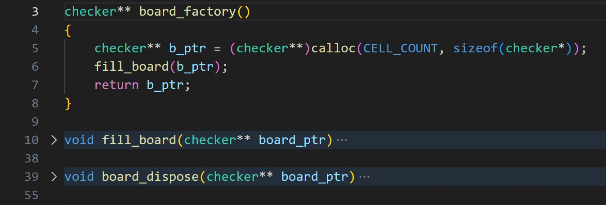

## EGR 111 - Introduction to Computer Science (C Programming)

### [EGR111](../../) - [Sprint 4](../) - Week 13

**Schedule**
- Week 13
  - Session 1 (today)
    - chkrs_v2 status and review
    - dynamic memory
    - stack vs heap
  - Session 2 
    - structs and unions
    - chkrs 3 with dynamic structs - demo only
- Week 14
  - Session 1 
    - chkrs_v2 status and review
    - Linked Lists
  - Session 2 
    - OOPS
    - Team report-out demo on Chkrs_v2
    - final project introduction
- Week 15
  - Session 1 - No class, final project working session
  - Session 2 - No class, final project due at end of the day    
  
**Session 1**
  
- [checker board image](chkr_brd.pdf){:target='_blank'}

- chkrs_v2 requirements
  - Review move_checker function
  - Enter comments as required in checkers.c. Include initials.
  - Implement is_valid_jump function
  - Implement jump_checker function
  - Determine make_king requirements
  - Implement make_king function
  - Validate make_king() function using unit tests
    - Create can_make_red_king unit test
    - Create can_make_black_king unit test

- Monday scrum
  - What have I done?
  - What do I need to do?
  - What impedements or blockers
  - Teams
    - Drew, Christian
    - Jaron, Lily
    - Nick, Sahil
    - Shane, Alex

- Memory concepts - data on the stack
  - Review of can_get_move_vectors()
  - Review of can_get_move_vectors2()
  - cannot_get_move_vectors() test has Segmentation fault (pointer is 0)

- Introduction to Stack vs. Heap
    - *Stack Memory*: The stack is a part of memory used for storing local variables and function call frames. When a function is called, the space for its local variables is created on the stack, and when the function returns, that space is automatically reclaimed. This makes stack memory very fast but limited in size.

    - *Heap Memory*: The heap is a region of memory used for dynamic memory allocation (using functions like malloc, calloc, or free). Memory in the heap persists until explicitly deallocated, and you have more control over its size, making it suitable for large or dynamically-sized data structures like arrays.

  - [Demo - bad code](brd_on_stack/main.c)   
  - [image of stack](brd_on_stack/checkers_on_stack.pdf){:target='_blank'} 

**Session 2**

- Review: Memory concepts - allocating heap
  - [Pointers and dynamic memory - stack vs heap](https://www.youtube.com/watch?v=_8-ht2AKyH4&ab_channel=mycodeschool){:target='_blank'}
    - four sections
      - program/code
      - Static/global
      - Stack
      - Heap 
  - Memory organization
    - 
  - Function calls with stack
    - 
  - Dynamic memory allocation - heap
    - 
  - 
  - 

  - [dynamic-memory-allocation](https://www.geeksforgeeks.org/dynamic-memory-allocation-in-c-using-malloc-calloc-free-and-realloc/){:target='_blank'}

- **Structures**
  - [C Structures](https://www.geeksforgeeks.org/structures-c/?ref=lbp){:target='_blank'}

```C
typedef struct Checker
{
    int index;
    bool is_empty;
    bool is_black;
    bool is_red;
    bool is_king;
    char name[4];

} checker;
```  

- test_checker.c
- checker_factory.c

### Assignments
- chkrs_v2 
  - in progress but push current solution this week
  - jump function implemented
  - king functions, integration, and testing started
  - progress reported in next week's stand up.

