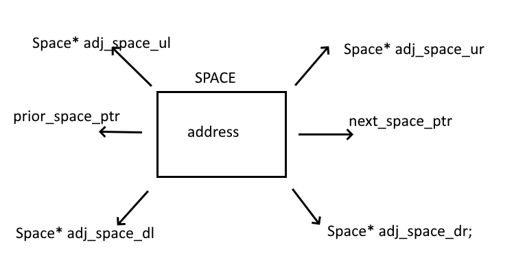

## EGR 111 - Introduction to Computer Science (C Programming)

### [EGR111](../../) - [Sprint 5](../) - Week 14

**Revised schedule**

- Week 14
  - Session 1 
    - chkrs_v2 status and review
    - chkrs_v2 due. Solution on Wednesday. Push your code!
    - Linked Lists
    - chkrs_linked demo
  - Session 2 
    - Chkrs_v2 solution
    - OOPS
    - Final Project - Introduction, Assigned
- Week 15
  - Session 1 - No class, final project working session
  - Session 2 - No class, final project due at end of the day    

**Session 1**

- Checkers V2
  - Status? Blockers? Final code pushed? *Demos?*
  - Teams
    - Drew, Christian
    - Jaron, Lily
    - Nick, Sahil
    - Shane, Alex
  - chkrs_v2 requirements
    - Implement is_valid_jump function
    - Implement jump_checker function
    - Determine make_king requirements
    - Implement make_king function
    - Validate make_king() function using unit tests
      - Create can_make_red_king unit test
      - Create can_make_black_king unit test
    - Final code pushed by tomorrow (Tuesday) night. Solution discussion on Wednesday

- [Linked Lists](https://www.geeksforgeeks.org/linked-list-in-c/){:target='_blank'}
- chkrs_linked - solution demo
  - 
  - status
  - unit tests
  - game play

**Session 2**

- Final code pull from all repos this morning

- Linked List, Graph review
  - Running chkrs_linked

- [Overview of Object-Oriented Programming (OOP)](oop_in_c.md){:target='_blank'}

<!-- - [Persistance](https://en.wikipedia.org/wiki/Persistence_(computer_science))
  - [What is a relational database management system?](https://www.codecademy.com/article/what-is-rdbms-sql){:target='_blank'}
  - [CRUD operations](https://en.wikipedia.org/wiki/Create,_read,_update_and_delete){:target='_blank'}
  - [CRUD using MySQL](https://www.geeksforgeeks.org/crud-operations-in-mysql){:target='_blank'}
  - [NoSQL](https://www.codecademy.com/article/introduction-to-nosql){:target='_blank'}
  - [REST webservices](https://www.geeksforgeeks.org/rest-api-introduction/){:target='_blank'} -->

- Week 15 final project install and review
  - **See Week 15**
  
---

### Assignments
-  None. Final Project is in progress. Due next Wednesday. Push to your repo. I'll be pulling final code on Wednesday morning.
